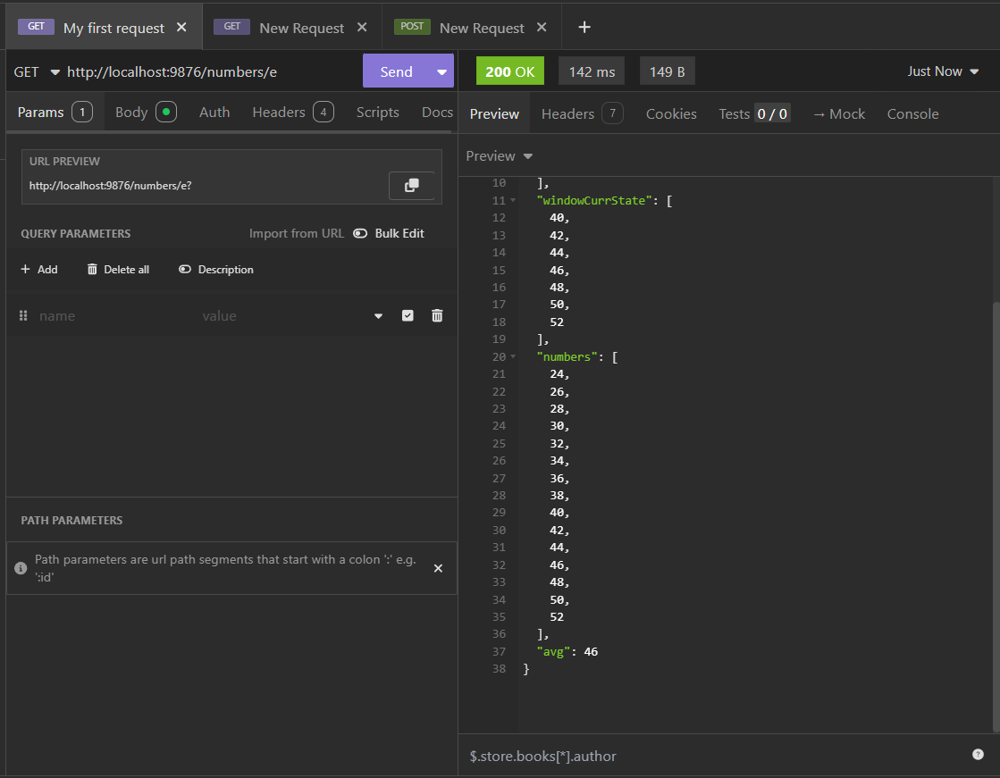

# OutPut for the first backend problem



# .env configuration

```
ACCESS_TOKEN=your_access_token
AUTH_URL= http://example.com/auth
CLIENT_ID = your_client_id
CLIENT_SECRET = your_client_secret
```

#Run server by:

```bash
node backend/src/server.js
```

# Response

```javascript
{
  "windowPrevState": [...],
  "windowCurrState": [...],
  "numbers": [...],
  "avg": 4.00
}
```
